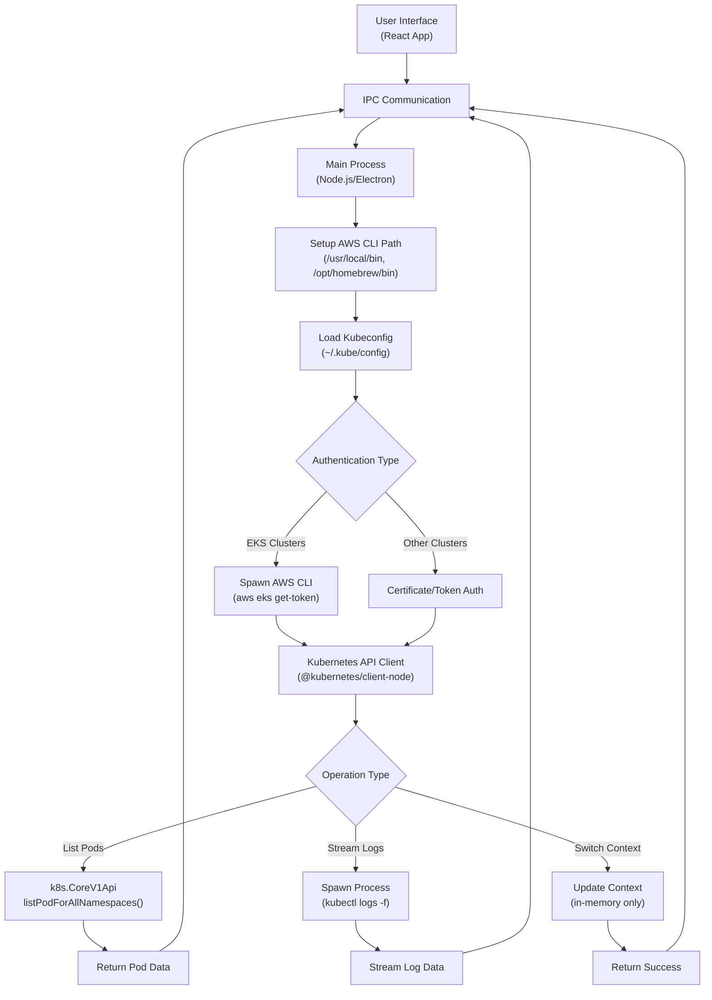

# K8s Manager

[](https://opensource.org/licenses/MIT)
[](https://electronjs.org/)
[](https://reactjs.org/)
[](https://www.typescriptlang.org/)

A lightweight, user-friendly Kubernetes cluster management GUI built with Electron and React. Designed for developers who need quick access to cluster information and pod logs without the complexity of command-line tools.

## ✨ Features

### Core Functionality

- 🔄 **Context Management**: View and switch between Kubernetes contexts seamlessly
- 📦 **Pod Monitoring**: Browse pods across namespaces with real-time status updates
- 📋 **Log Streaming**: Stream and search pod logs with one-click copy functionality
- 🔍 **Namespace Filtering**: Filter pods by namespace for better organization
- ⏰ **Real-time Updates**: Live pod status and log streaming

### User Experience

- 🖥️ **Desktop Native**: Cross-platform Electron application
- 🎨 **Modern UI**: Clean, responsive interface built with Tailwind CSS
- 🚀 **No Setup Required**: No registration, no configuration files
- 📱 **Intuitive Design**: Point-and-click interface for common Kubernetes tasks

## 🚀 Getting Started

### Download & Install

<div align="center">
  <a href="https://github.com/your-username/k8s-manager/releases/latest" style="text-decoration: none;">
    <div style="
      display: inline-flex;
      align-items: center;
      background: linear-gradient(135deg, #667eea 0%, #764ba2 100%);
      color: white;
      padding: 16px 32px;
      border-radius: 12px;
      font-family: -apple-system, BlinkMacSystemFont, 'Segoe UI', Roboto, sans-serif;
      font-size: 18px;
      font-weight: 600;
      box-shadow: 0 8px 32px rgba(102, 126, 234, 0.4);
      transition: all 0.3s ease;
      border: none;
      cursor: pointer;
      margin: 20px 0;
    ">
      <svg width="24" height="24" viewBox="0 0 24 24" fill="currentColor" style="margin-right: 12px;">
        <path d="M18.71 19.5c-.83 1.24-1.71 2.45-3.05 2.47-1.34.03-1.77-.79-3.29-.79-1.53 0-2 .77-3.27.82-1.31.05-2.3-1.32-3.14-2.53C4.25 17 2.94 12.45 4.7 9.39c.87-1.52 2.43-2.48 4.12-2.51 1.28-.02 2.5.87 3.29.87.78 0 2.26-1.07 3.81-.91.65.03 2.47.26 3.64 1.98-.09.06-2.17 1.28-2.15 3.81.03 3.02 2.65 4.03 2.68 4.04-.03.07-.42 1.44-1.38 2.83M13 3.5c.73-.83 1.94-1.46 2.94-1.5.13 1.17-.34 2.35-1.04 3.19-.69.85-1.83 1.51-2.95 1.42-.15-1.15.41-2.35 1.05-3.11z"/>
      </svg>
      Download for macOS
      <div style="
        margin-left: 8px;
        font-size: 14px;
        opacity: 0.9;
        font-weight: 400;
      ">v1.0.0</div>
    </div>
  </a>
</div>

**Installation Steps:**

1. Click the download button above to get the latest DMG file
2. Open the downloaded DMG file
3. Drag K8s Manager to your Applications folder
4. Launch K8s Manager from Applications or Spotlight

### Prerequisites

- macOS 10.15 (Catalina) or later
- kubectl configured with access to your Kubernetes clusters
- Valid kubeconfig file (typically located at `~/.kube/config`)

### First Launch

1. Open K8s Manager
2. The app will automatically detect your kubeconfig contexts
3. Select a context from the dropdown to start exploring your cluster
4. Choose a namespace and browse your pods
5. Click on any pod to view its logs

> **Note**: K8s Manager reads your existing kubectl configuration. No additional setup required!

## 🎯 Use Cases

- **Development Teams**: Quick access to staging/development cluster information
- **DevOps Engineers**: Rapid troubleshooting and log analysis
- **Kubernetes Beginners**: GUI-first approach to cluster management
- **Multi-cluster Management**: Easy context switching between different environments

## 🛠️ Technology Stack

- **Frontend**: React 19, TypeScript, Tailwind CSS
- **Desktop Framework**: Electron 37
- **Kubernetes Integration**: @kubernetes/client-node
- **Build System**: Webpack, Electron Forge
- **Icons**: Lucide React

## ⚙️ How It Works Behind the Scenes

### Architecture & Execution Flow



### Key Points

- **Electron Architecture**: Main process handles Kubernetes operations, renderer process manages UI
- **Authentication**: Automatically detects and uses AWS CLI for EKS clusters, supports all kubectl auth methods
- **Path Resolution**: Searches common installation paths for required binaries (aws, kubectl)
- **Read-Only**: Only retrieves cluster information, never modifies resources
- **Local Operations**: Uses your existing kubeconfig and credentials, no external data transmission

### Common Troubleshooting

| Issue              | Cause                      | Solution                                                               |
| ------------------ | -------------------------- | ---------------------------------------------------------------------- |
| "spawn aws ENOENT" | AWS CLI not in PATH        | App auto-detects AWS CLI paths. Ensure `aws --version` works           |
| No contexts found  | Missing/invalid kubeconfig | Verify `~/.kube/config` exists and `kubectl config get-contexts` works |
| Connection errors  | Network/firewall issues    | Same requirements as kubectl - ensure cluster endpoints are accessible |

## 📋 Current Limitations

K8s Manager is designed as a **read-only cluster viewer** and **log monitoring tool**. It currently does not support:

- Creating or modifying Kubernetes resources
- Cluster provisioning or management
- Pod deployment or scaling operations
- Advanced kubectl operations

For these operations, please continue using `kubectl` or other specialized tools.

## 🤝 Contributing

We welcome contributions! Whether it's bug fixes, new features, or documentation improvements, your help is appreciated.

### Development Setup

1. Fork the repository
2. Clone your fork:

```bash
git clone https://github.com/your-username/k8s-manager.git
cd k8s-manager
```

3. Install dependencies:

```bash
npm install
```

4. Start the development server:

```bash
npm start
```

5. Build for production:

```bash
# Package the app
npm run package

# Create distributable
npm run make
```

### Development Prerequisites

- Node.js (v16 or higher)
- kubectl configured with access to your Kubernetes clusters
- Valid kubeconfig file

### Contributing Process

1. Create your feature branch (`git checkout -b feature/amazing-feature`)
2. Make your changes and test them
3. Commit your changes (`git commit -m 'Add some amazing feature'`)
4. Push to the branch (`git push origin feature/amazing-feature`)
5. Open a Pull Request

Please see our [Contributing Guidelines](CONTRIBUTING.md) for more detailed information.

## 📝 License

This project is licensed under the MIT License - see the [LICENSE](LICENSE) file for details.

## 👨‍💻 Author

**Richard Ng** - [richard.ng.cccc@gmail.com](mailto:richard.ng.cccc@gmail.com)

## 🙏 Acknowledgments

- Built with ❤️ using Electron and React
- Icons provided by [Lucide](https://lucide.dev/)
- Kubernetes client integration via [@kubernetes/client-node](https://github.com/kubernetes-client/javascript)

---

**Note**: This tool complements your existing Kubernetes workflow and is not intended to replace kubectl for advanced operations.
